## SD카드 백업 시 불편함
RaspberryPi 환경에서 개발을 진행하며 프로젝트의 버전관리를 SD카드 백업을 통해 진행하였다. SD카드를 백업하는 일에 시간을 뺏기는 경우가 많았다.

RaspberryPi OS(Raspbian) 및 동작 프로그램은 수 GB를 넘기지 않지만,
보편화된 Windows 응용프로그램 Win32Imager를 사용하여 생성한 백업 이미지 파일은 SD카드 전체용량과 동일한 사이즈의 이미지 파일로 백업되고 백업에 시간도 오래 걸린다. 또, 새로운 SD카드에 복제할 때도 시간이 오래 걸린다.
심한 경우, 같은 용량의 SD카드를 사용하더라도 제작 업체마다 실제 가용 용량이 조금씩 다르기 때문에 **실제로 32GB SD카드를 백업한 이미지 파일을 32GB SD카드에 쓸(Write) 수 없는 경우도 생겼다.**
**때문에 항상 같은 회사의 SD카드 재고를 충분히 보유해야하는 불편함도 있다.**

이 문제를 깔끔하게 해결할 방법이 있다.

## 해결

1. GParted로 빈 공간 줄이기

   * Linux 디스크 파티션 Edit 툴인 GParted를 사용
   * RaspberryPi에서 사용한 SD카드를 Linux OS에서 읽어 GParted를 통해 디스크를 줄일 수 있음
   * 준비물 : GParted 어플리케이션을 설치한 **Linux 환경 PC** 과 **SD카드 리더기**


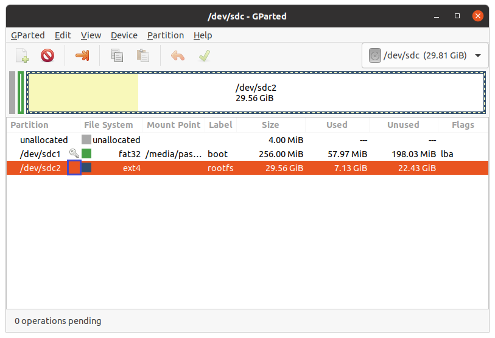
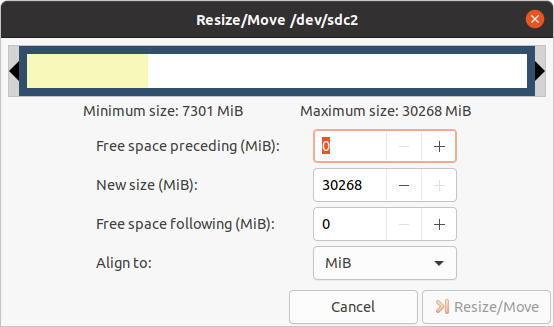
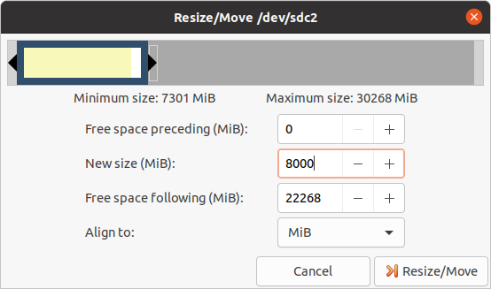
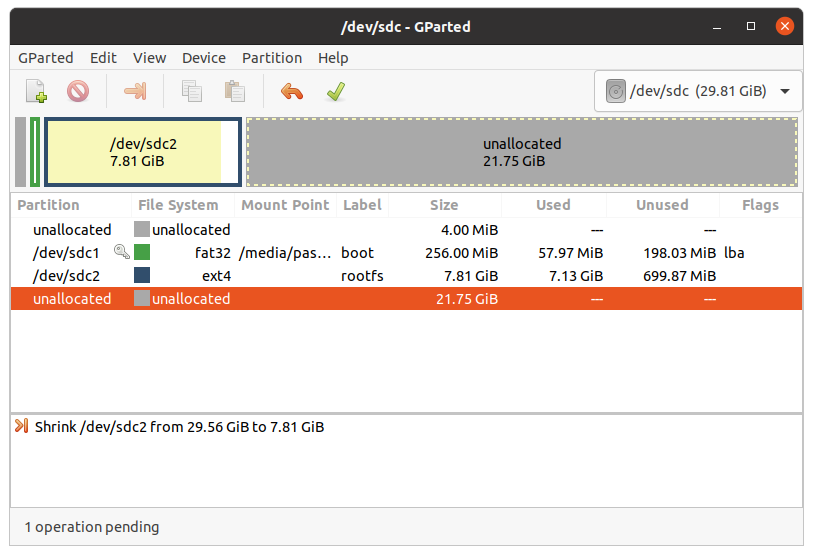
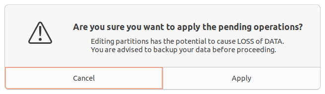
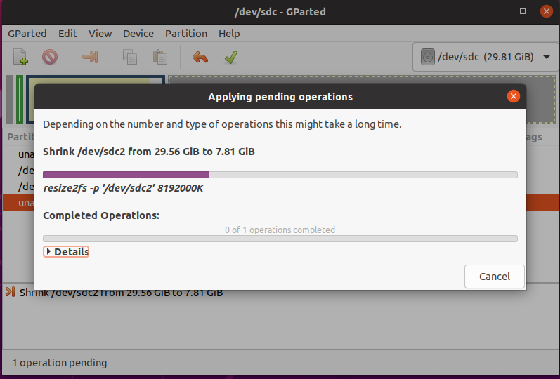
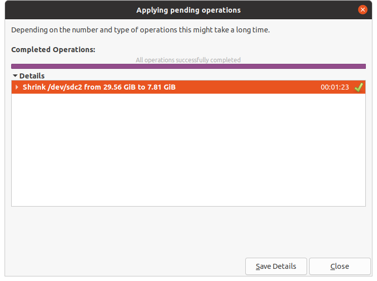
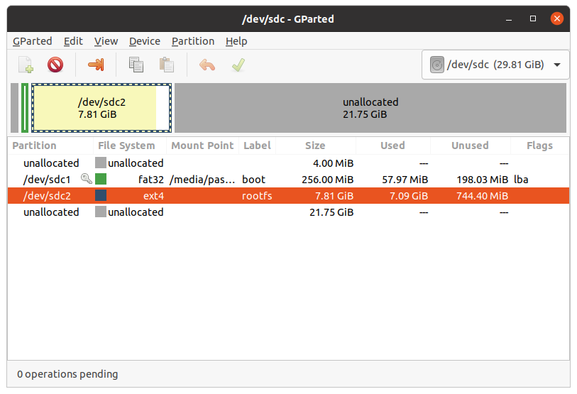
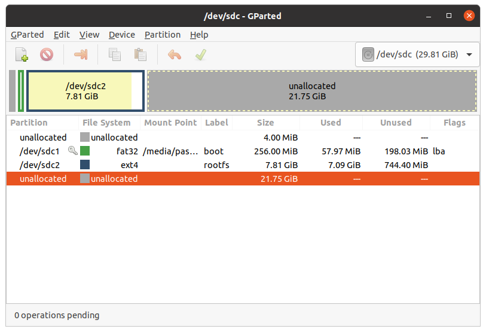
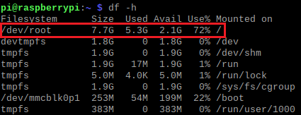
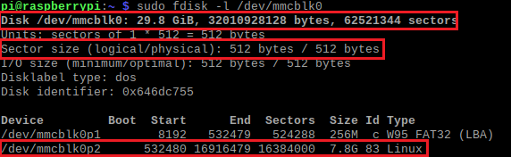
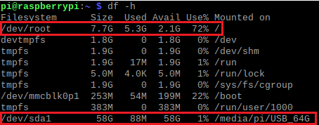
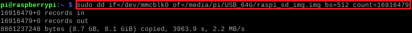
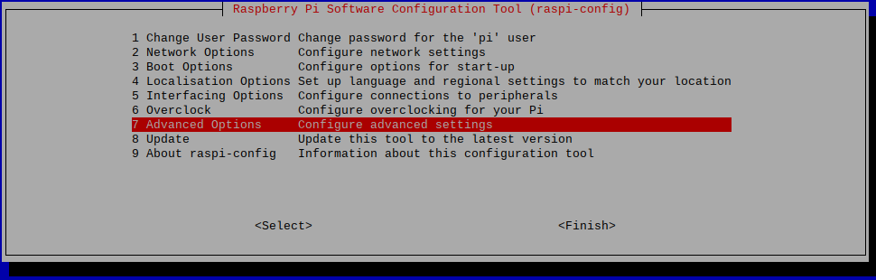
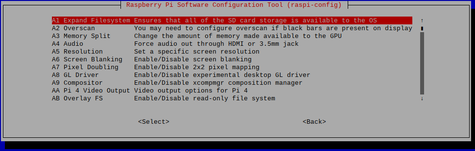
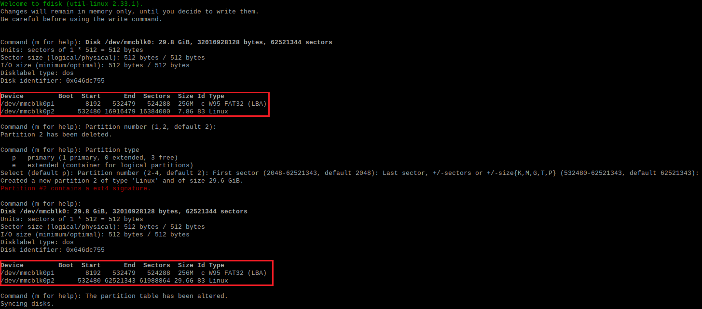


2. 디스크 복사하여 이미지파일 만들기

이미지 파일을 윈도우즈 어플리케이션인 Win32Imager와 SD카드 리더기를 통해 만드는 대신,

RaspberryPi 를 실행한 상태에서, 직접 dd 커맨드를 통해 이미지를 생성한다.

(Duplicate Disk 약어가 아닐까 생각하니 까먹지 않음ㅋ)

RaspberryPi 에서 아래 커맨드를 입력하여 SD카드의 파티션 정보를 확인한다.

~~~
sudo fdisk -l /dev/mmcblko
~~~


출력되는 정보의 SectorSize, End 부분을 확인한다.
3. 빈 공간 원상복구하기
* 저장공간으로 활용할 수 있는 디스크 용량 다시 원상복구하는 과정


And here is the same code with syntax highlighting:

```javascript
var foo = function(x) {
  return(x + 5);
}
foo(3)
```

And here is the same code yet again but with line numbers:


var foo = function(x) {
  return(x + 5);
}
foo(3)


## Boxes
You can add notification, warning and error boxes like this:

### Notification

{: .box-note}
**Note:** This is a notification box.

### Warning

{: .box-warning}
**Warning:** This is a warning box.

### Error

{: .box-error}
**Error:** This is an error box.
